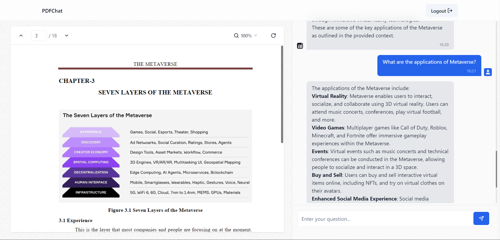

# PDFChat - Chat with your Documents in seconds.



This is a repository for PDFChat application built With Nextjs, Tailwind, Shandcn-UI, OpenAI API.

Features:

- 🌐 Next.js 14 framework
- 🔐 Firebase Login using your Google account
- 💅 TailwindCSS & ShadcnUI styling
- 💾 Prisma ORM and PostgreSQL
- ⬆️ PDF File upload using UploadThing
- ⛓️ Langchain Framework
- 🗃️ Pinecone API vector database
- 💬 Chat functionality
- 🧠 OpenAI embeddings model and API

### Prerequisites

**Node version 14.x**

### Cloning the repository

```shell
git clone https://github.com/aditya-2010/pdf-chat.git
```

### Install packages

```shell
npm install
```

### Setup .env file

```js
DATABASE_URL=
DIRECT_URL=
NEXT_PUBLIC_FIREBASE_API_KEY=
NEXT_PUBLIC_FIREBASE_AUTH_DOMAIN=
NEXT_PUBLIC_FIREBASE_PROJECT_ID=
NEXT_PUBLIC_FIREBASE_STORAGE_BUCKET=
NEXT_PUBLIC_FIREBASE_MESSAGE_SENDER=
NEXT_PUBLIC_FIREBASE_APP_ID=
NEXT_PUBLIC_FIREBASE_MEASUREMENT_ID=
NEXT_PUBLIC_FIREBASE_PRIVATE_KEY=
NEXT_PUBLIC_FIREBASE_CLIENT_EMAIL=
UPLOADTHING_SECRET=
UPLOADTHING_APP_ID=
PINECONE_API_KEY=
OPENAI_API_KEY=
```

### Start the app

```shell
npm run dev
```
